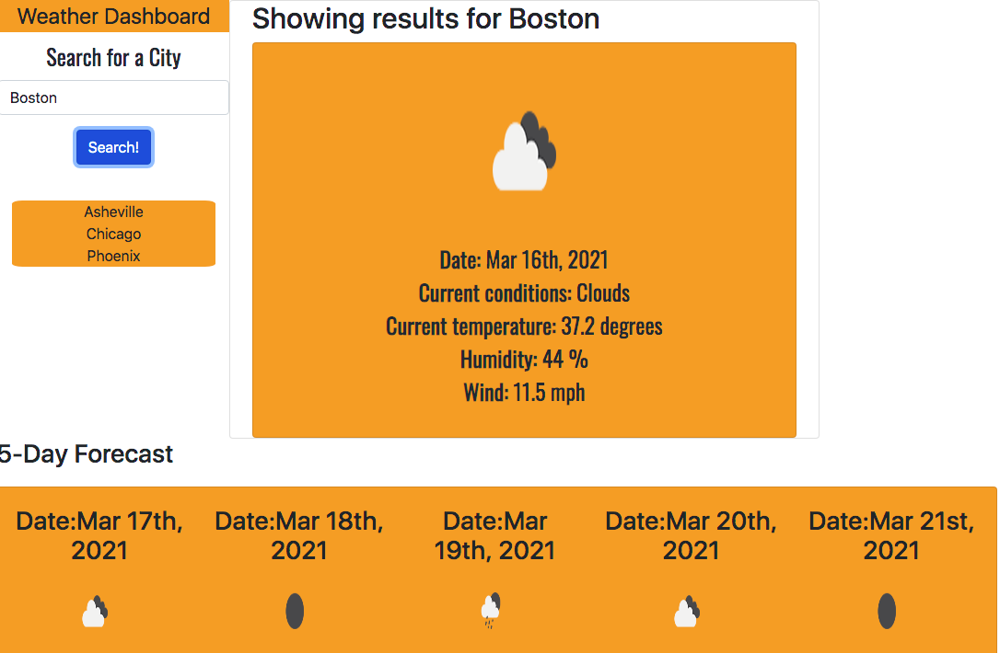

# Weather-dashboard

This application allows the user to search for a city and see the current weather along with a 5 day forecast. The user can also see previous searches and revisit them with a simple click. This application use the OpenWeather API to retrieve weather data for cities and dynamically updates HTML and CSS powered by JavaScript and JQuery.

## Built with

This project is created with:

Bootstrap 
CSS
Google Fonts
HTML
JavaScript
jQuery
Moment.js
Open Weather API

## Link

 https://barbarashea.github.io/weather-dashboard/

## Preview

